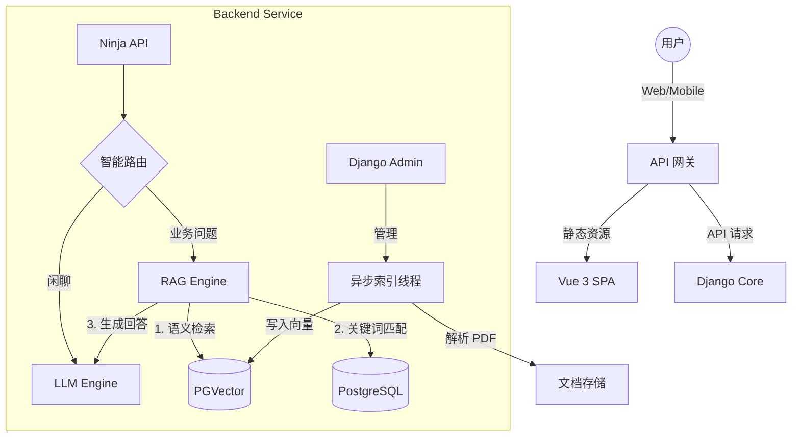

# AI 智能客服系统 - 项目白皮书 (Project Whitepaper)
> **版本**: v3.1 (MCP + Smart RAG) | **最后更新**: 2026-01-17
> **定位**: 私有化部署的企业级 Hybrid RAG 智能问答系统

---

## 1. 项目概览 (Overview)

本项目旨在构建一套**高精度、低延迟、私有化**的 AI 智能客服系统。不同于简单的 LLM 套壳，本系统深度集成了企业知识库，利用 **Hybrid RAG (混合检索增强生成)** 技术，解决大模型"幻觉"问题，提供精准的业务问答服务。

### 核心价值
*   **企业级精准度**: 结合向量语义检索与数据库关键词匹配，确保答案有据可查。
*   **极致响应**: 全链路流式响应 (Streamable)，首字延迟 (TTFT) < 1秒。
*   **数据安全**: 支持全私有化部署 (NAS/本地服务器)，文档删除彻底无残留。
*   **管理便捷**: 内置完整的 Django Admin 后台，支持可视化文档管理与状态监控。

---

## 2. 技术架构 (Architecture)

### 2.1 逻辑架构
系统采用 **微服务化单体 (Modular Monolith)** 架构，便于开发维护与部署。

### 2.2 核心技术栈
| 层级 | 技术选型 | 优势 |
|:-----|:---------|:-----|
| **后端** | **Django 6.0 + Ninja** | 生态成熟，Admin 组件强大，异步支持好 |
| **前端** | **Vue 3 + TypeScript** | 响应式交互，开发效率高 |
| **RAG 引擎** | **LlamaIndex** | 文档处理流水线最强，支持高级检索策略 |
| **数据库** | **PostgreSQL 17** | All-in-One 方案 (关系型数据 + pgvector 向量) |
| **LLM** | **DeepSeek V3** | 高性价比，OpenAI 兼容协议 |
| **Embedding** | **BGE-small-zh** | 本地运行，中文语义理解效果最佳 |

---

## 3. 功能特性与进度 (Features & Progress)

### ✅ 已完成特性 (Production Ready)

#### 🚀 核心检索与对话
- [x] **Hybrid RAG 路由**: 自动判断意图。向量分数<0.5且无关键词命中时，自动降级为闲聊模式。
- [x] **流式响应 (Streamable HTTP)**: 实现打字机效果，采用 NDJSON 协议，支持中途打断。
- [x] **单例模型缓存**: Embedding/LLM 实例全局复用，消除从零加载延迟。
- [x] **RAG 溯源**: 回答自动附带参考文档的文件名与页码，点击可查看。

#### 📚 知识库管理
- [x] **全格式支持**: 重点优化 PDF 解析 (pdfplumber)，支持中文表格/段落。
- [x] **异步索引**: 文件上传后后台线程自动处理，不阻塞前端操作。
- [x] **数据强一致性**: **"彻底删除"** 机制，确保物理文件、DB记录、向量数据三位一体同步删除。
- [x] **可视化状态**: Admin 界面提供红黄蓝绿四色状态标签，监控索引进度。

#### 💬 会话交互
- [x] **多会话管理**: 侧边栏会话列表，支持切换、删除。
- [x] **自动标题**: 根据首条消息自动生成会话摘要。
- [x] **历史持久化**: 完整保存对话历史，支持浏览器刷新重连。
- [x] **UI 细节**: 消息时间戳、长历史折叠、移动端适配。
- [x] **响应耗时显示**: AI 回复显示生成耗时，如 `⏱️ 1.2s`。
- [x] **用户消息时间戳**: 用户发送的消息也显示时间。

#### 🔧 MCP 工具集成 (v3.1 新增)
- [x] **MCP Client 集成**: 基于 LlamaIndex `McpToolSpec` 连接外部 MCP Server。
- [x] **Admin 配置管理**: 在后台配置 MCP Server（支持 STDIO/HTTP 两种模式）。
- [x] **语义路由**: 基于向量相似度自动判断是否调用工具（阈值 0.4）。
- [x] **工具来源显示**: 回复显示“🔧 来源工具高德”而非原始工具 ID。
- [x] **参数询问**: 工具缺少必要参数（如城市）时，先询问用户。

#### 🎯 智能 RAG 检索 (v3.1 优化)
- [x] **精确/模糊区分**: 区分精确关键词匹配与 n-gram 模糊匹配。
- [x] **模糊匹配确认**: 模糊匹配时先询问用户确认，避免给出不相关答案。
- [x] **多文档选择**: 多个文档匹配时，列出来源让用户选择。
- [x] **n-gram 分词**: 支持拆分中文关键词进行 AND 组合匹配。

---

### 🟡 待开发计划 (Roadmap)

#### Phase 1: 体验增强 (优先级: 高)
- [x] **多模型配置中心**: ✅ 已完成
    - **后台管理**: 在 Django Admin 中配置 LLM (DeepSeek/GPT/Claude) 的 `API_KEY`、`BASE_URL` 和 `Model Name`。
    - **全局/租户策略**: 动态切换系统默认使用的模型，无需重启服务。
- [ ] **深色模式**: 适配系统级 Dark Mode，提供更沉浸的夜间体验。
- [ ] **文档上传前端化**: 允许用户直接在聊天界面拖拽上传文档进行分析，无需进入 Admin。

#### Phase 2: 企业级特性 (优先级: 中)
- [x] **Agent 进化 (MCP 架构)**: ✅ 已完成
    - **核心决策**: 弃用传统 FunctionTool，全面拥抱 **Model Context Protocol (MCP)** 标准。
    - **MCP Client**: 集成 LlamaIndex `McpClient`，连接外部 MCP Server。
    - **场景落地**: 已集成高德地图 MCP Server（天气、地理编码、导航等 12 个工具）。
- [ ] **用户权限体系**: 
    - 接入企业 SSO / LDAP。
    - 实现文档级别的权限控制 (Public/Private)。
- [ ] **增强文档支持 (白名单制)**:
    - **文本类**: `TXT`, `MD`, `HTML`, `XML`
    - **办公文档**: `PDF` (重点优化), `DOCX`, `PPTX` (幻灯片), `XLSX` (表格), `CSV`
    - **电子书**: `EPUB`
    - *需在 Django Model 层配置 FileExtensionValidator 进行严格校验。*

#### Phase 3: 运维与部署 (优先级: 低)
- [ ] **生产环境配置**: Nginx HTTPS 配置、Gunicorn/Uvicorn 生产级部署脚本。
- [ ] **监控告警**: 接入 Prometheus/Grafana 监控 RAG 检索命中率与响应时间。

---

## 4. 开发日志精选 (Log Highlights)

> 记录项目关键的决策点与里程碑。

*   **2026-01-17 (v3.1)**: 完成 MCP 工具集成与智能 RAG 优化。实现工具来源显示、参数询问、模糊匹配确认、多文档选择。切换 Admin UI 为 SimpleUI (2026.1.13)。
*   **2026-01-16 (v2.3)**: 完成 Admin 体验重构。实现状态只读、彩色标签及异步索引线程。解决 LlamaIndex UUID 导致的数据删除残留问题。
*   **2026-01-15 (v2.2)**: 实现聊天打断与多会话列表。优化 RAG 提示词，强制使用 Markdown 格式并隐藏冗余来源说明。
*   **2026-01-14 (v2.1)**: 上线 Hybrid RAG 策略。引入关键词匹配 (Postgres ILIKE) 修正向量检索对专有名词 (如"新津区四色餐馆") 召回率低的问题。
*   **2026-01-11 (v1.5)**: 完成 RAG 最小闭环。集成 pdfplumber + BGE + PGVector。
*   **2026-01-09 (v1.0)**: 项目初始化。搭建 Django + Vue + Docker 基础脚手架。
